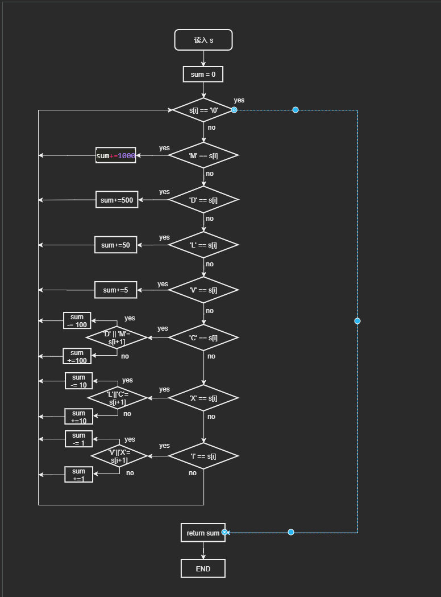

# 罗马数字转整数

### 1.解题思路

> 这道题 拿到手里面 思路很清晰
> * 首先枚举所有的组合可能性并添加到哈希表中, 
> * 然后对字符串进行遍历，由于组合只有两种，一种是 1 个字符，一种是 2 个字符，其中 2 个字符优先于 1 个字符
> * 先判断两个字符的组合在哈希表中是否存在，存在则将值取出加到结果 ans 中，并向后移2个字符。不存在则将判断当前 1 个字符是否存在，存在则将值取出加到结果 ans 中，并向后移 1 个字符
> * 遍历结束返回结果 ans    
### 很遗憾的是 C 中没有 Hashmap, 咱还是老老实实的用 switch case 吧.
>
> 其实这道题的逻辑很清晰,就是简单的逻辑累加,遇到特殊情况就 减掉相应 值, 过一遍题目, 很清晰的 可知 `I X C` 三个字母可以 放在 特定字母的左边,而且放左边的时候都有个特性 都比特定字母 小自己的本身的值, 例如 `IV` 比 `V` 小 `I` , `XC` 比 `C` 小 `X`, 很容易就可以得出逻辑 每次检测 `I X C` 三个字母时,看一看后面是否有 特殊字符, 存在则减去 本身, 不存在则 加上本身, 循环到字符结束, 即为答案  
> #### 简单逻辑如下
>> * 判断 `s[i]` 是否为 特殊字符, 
>>      * 不是, 累加
>>      * 是,   判断 `s[i+1]` 是否 存在 受体罗马数字 ,
>>          * 是    减去本身
>>          * 不是  正常累加
>> * 直到循环结束, sum 即为饭hi结果


### 2.流程图

> 


### 3.代码

>```c
> int romanToInt(char *s)
>{
>    int sum = 0;
>    for (int i = 0; s[i]; i++)
>    {
>        switch (s[i])
>        {
>        case 'M': sum += 1000;  break;
>        case 'D': sum += 500;   break;
>        case 'L': sum += 50;    break;
>        case 'V': sum += 5;     break;
>        case 'C':
>            ('D' == s[i + 1] || 'M' == s[i + 1]) ? (sum -= 100) : (sum += 100);
>            break;
>        case 'X':
>            ('L' == s[i + 1] || 'C' == s[i + 1]) ? (sum -= 10) : (sum += 10);
>            break;
>        case 'I':
>            ('V' == s[i + 1] || 'X' == s[i + 1]) ? (sum -= 1) : (sum += 1);
>            break;
>        default:
>            break;
>        }
>    }
>    return sum;
>}
>```