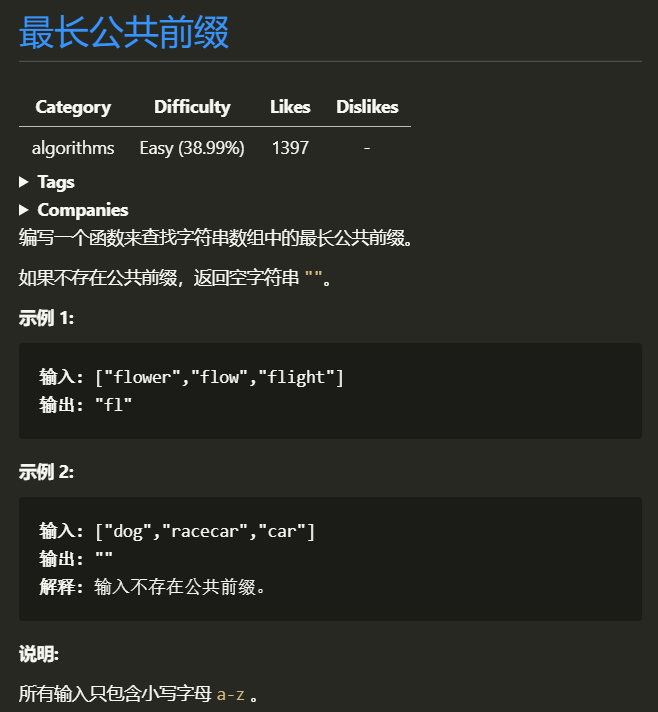
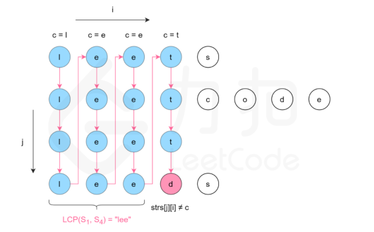
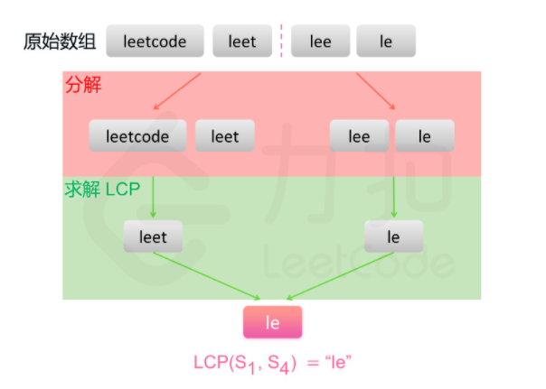

# 最长公共前缀
##### 这次没有流程图

### 1.1 题目


### 1.2 思路：
>    老实说，这道题目一开始我只想到了暴力的解题方法，纵向扫描法，简单来说就是一列一列的扫描字母，只要有不同就直接在当前位置放入`'\0'` 返回 `strs[0]`. 很显然这是一个 O(m*n) 级复杂度的算法

>一般来说这种复杂度可以 优化 为 nlogn 很容易就会想到第二种解法——分治, 简单来说, 就是 将 strsSize 分到最小化, 即两两比较后返回最大子序列,将子序列,再进行 比较 得出子序列的最长子序列,最终得出的字符串即为返回值
### 1.3 图解思路
#### 由于个人画图能力有限,列下图片来源于 LeetCode 官方
> #### 2.1 纵向扫描
> 
> #### 2.2 分治
> 
> 

### 1.4 代码
> #### 1.4.1 纵向扫描
>```c
> char *longestCommonPrefix(char **strs, int strsSize)
> {// 纵向扫描
>     if (0 == strsSize)
>         return "";
>     for (int i = 0; strs[0][i]; i++)
>     {
>         for (int j = 1; j < strsSize; j++)
>         {
>             if (strs[0][i] != strs[j][i])
>             {
>                 strs[0][i] = '\0';
>                 return strs[0];
>             }
>         }
>     }
>     return strs[0];
> }
>```
> #### 1.4.2 分治
>```c
> char *getPrefix(char *lStr, char *rStr)
> {
>     for (int i = 0; '\0' != lStr[i]; i++)
>     {
>         if (lStr[i] != rStr[i])
>         {
>             lStr[i] = '\0';
>             return lStr;
>         }
>     }
>     return lStr;
> }
> 
> char *getLongestCommonPrefix(char **strs, int start, int end)
> {
>     if (end == start)
>         return strs[start];
> 
>     // 二分防溢出
>     int mid = (end - start) / 2 + start;
> 
>     // 递归分治
>     char *lcpL = getLongestCommonPrefix(strs, start, mid);
>     char *lcpR = getLongestCommonPrefix(strs, mid + 1, end);
> 
>     // 获取最终子序列
>     return getPrefix(lcpL, lcpR);
> }
> 
> char *longestCommonPrefix(char **strs, int strsSize)
> {
>     if (0 == strsSize)
>         return "";
> 
>     return getLongestCommonPrefix(strs, 0, strsSize - 1);
> }
>```