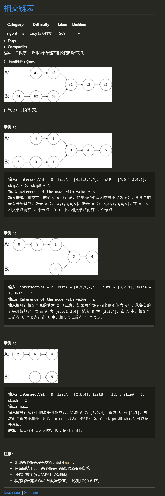

# 换酒问题

## 1 题目


## 2 解题思路
> 题目看似很难(一大堆输入看到脑壳疼),其实就是检测两个链表什么时候能地址相同, 毕竟值可能会一样,地址肯定不会.最简单的方法就是暴力 对链表A中的每一个结点 ai 遍历整个链表 B 并检查链表 B 中是否存在结点和 ai 相同的节点. 很显然这种方法,时间复杂度超过了 O(n), 题目要求我们用 O(n)的思路写出来,所以我去纠结了一下, 发现了一些规律:  
    链表A长 10, 链表长 15,他们的相交点一定在 第5个节点之后,所以只需要找后面10个节点里有没有相同的.这时候可以先让链表A 跑完第一圈 然后 链表B 刚好停在倒数第5个,  链表A和链表B 差值 刚好位5 如果我们让他们继续各自跑在自己的链表上 遍历5次就可以相遇, 不过这样子效率还是低了一些, 如果我们让跑完的 A 去 走一走 B 的路,当 B 走完之后,让它去走一走 A 的路,这样子 A 和 B 就相遇了(所以说,恋爱需要换位思考)


## 3 图解思路

图片来源于leetcode

## 3 代码
### 3.1 模拟法
```c
struct ListNode *getIntersectionNode(struct ListNode *headA, struct ListNode *headB)
{
    if (!(headA && headB))
        return NULL;
    struct ListNode *tp1 = headA, *tp2 = headB;

    while (tp1 != tp2)
    {
        tp1 = tp1 ? tp1->next : headB;
        tp2 = tp2 ? tp2->next : headA;
    }
    return tp1;
}
```