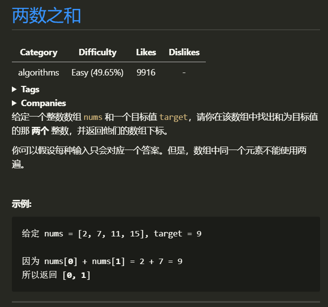
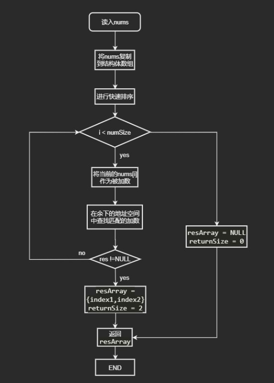

# 两数之和
> 说明: 2.c文件的解法会超时,之前是不会的,暴力AC就是不靠谱
## 1.1 题目

## 1.2解题思路
> 我拿到这道题的第一个想法就是 快速排序,但是转念一想,这玩意要返回的是索引.唉,真就,绝了……  
> 当时脑子一抽就和快排干上了,既然不能改变索引值,那么干脆存下来.所以就有了结构体
> ```c
> typedef struct MyStruct
> {
>   int value;  // 存放 大小
>   int index;  // 存放 索引
> } NumArray;
> ```
> 这就简单了写个 ```cmp``` 函数, ```qsort``` 一下, 然后 用 ```bsearch``` 搜索 ```target-num[i]``` 的值 就可以得出答案,时间复杂度为 O(2nlogn+n)  
> 当然这道题肯定存在 O(n) 的解法,无非就是模拟 哈希表 来实现快速查找,牺牲空间换时间, 由于手写Hash 过于麻烦,也不喜欢用非标准库的用户Hash库 ```UT_hash_handle``` 所以就直接在 c++ 题解中使用了  

  

## 1.3流程图
>

## 1.4代码
>
```c
typedef struct MyStruct
{
    int value;
    int index;
} NumArray;

int cmp(const void *a, const void *b)
{
    return ((NumArray *)a)->value - ((NumArray *)b)->value;
}

int *twoSum(int *nums, int numsSize, int target, int *returnSize)
{
    int *resArray = (int *)malloc(2 * sizeof(int));
    *returnSize = 0;

    // 复制数组,存储下数组的值和其序号
    NumArray *numArray = (NumArray *)malloc(sizeof(NumArray) * numsSize);
    for (int i = 0; i < numsSize; i++)
    {
        numArray[i].index = i;
        numArray[i].value = nums[i];
    }

    // 根据值大小 快速排序
    qsort(numArray, numsSize, sizeof(numArray[0]), cmp);

    for (int i = 0; i < numsSize; i++)
    {
        NumArray key = {.value = target - numArray[i].value};

        // 也是 循环 但采用二分查找 时间复杂度 (logn);
        NumArray *res = bsearch(&key, &numArray[i + 1], numsSize - i - 1, sizeof(numArray[0]), cmp);

        if (res)
        {
            resArray[0] = numArray[i].index;
            resArray[1] = res->index;
            *returnSize = 2;
        }
    }
    return resArray;
}
```

