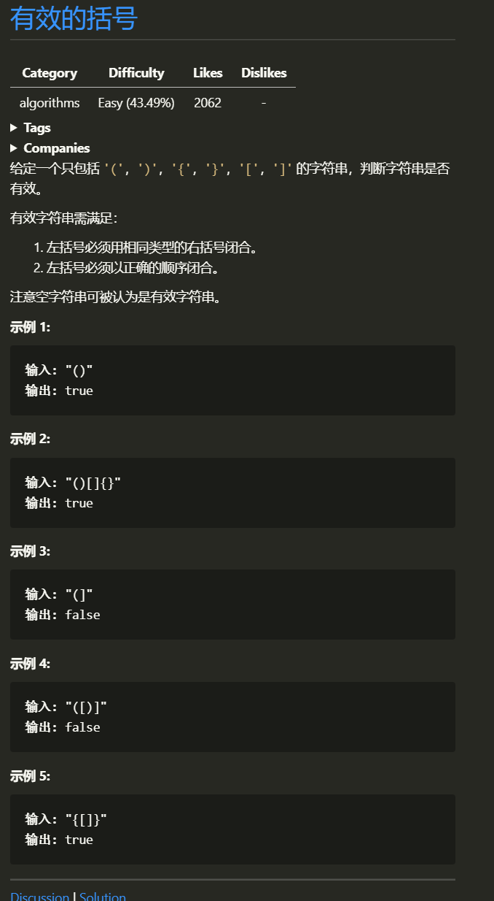

# 有效的括号
### 1.1 题目


## 1.2 思路
> 一道很简单的算法题, 典型的栈解, 不过 `c` 没有栈, 只能用数组模拟一个栈,解题思路核心就是 消消乐 (好吧, 我不玩)每次读入 左括号时存入 对应的右括号, 遇到右括号时,进行消除,如果不匹配, 返回 false, 或者栈顶为空,返回 false.

## 1.3 图解思路
> 

## 1.4 代码
>```c
> bool isValid(char *s)
> {
>     const int len = strlen(s);
>     if (len % 2)
>         return false;
>     int index = -1;
>     char *stack = (char *)calloc(len + 1, sizeof(char));
> 
>     for (int i = 0; i < len; i++)
>     {
>         if ('(' == s[i])
>         {
>             stack[++index] = ')';
>         }
>         else if ('[' == s[i])
>         {
>             stack[++index] = ']';
>         }
>         else if ('{' == s[i])
>         {
>             stack[++index] = '}';
>         }
>         else if (index == -1 || stack[index] != s[i])
>         {
>             return false;
>         }
>         else
>         {
>             index--;
>         }
>     }
>     return (-1 == index);
> }
>```