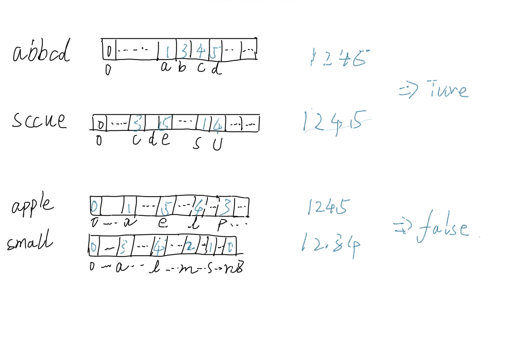

# 同构字符串

## 1. 题目
>

## 2. 解题思路
> 这道题我最开始想用 开桶的方式 对 字符统计 例如 `abaab` 存入桶中 为 `10110` 很遗憾的是 没有实现, 最后采用的是 技术比较, 以 字符的 `ASCII` 为索引, 如果 `Hahs[t[i]] == 0`, 则 将 索引+1 的值写 当前字母ASCII位置 .例如 `abbcd` 和 `sccue` , 他们经过计算得出的 数据都是 `1345` 所以 这两个字符串是同构字符串. 而像 `apple` 和 `small` 计算出的 数是 `1245` 和 `1234`, 存在不同数据,所以不是同构字符串

## 3. 图解思路
> 

## 4. 代码
> ```c
> bool isIsomorphic(char *s, char *t)
> {
>     int len = strlen(s);
>     unsigned char sHash[128] = {0}, tHash[128] = {0};
> 
>     if (!len)
>         return true;
> 
>     for (int i = 0; i < len; i++)
>     {
>         if (!sHash[s[i]])
>         {
>             sHash[s[i]] = i + 1;
>         }
>         if (!tHash[t[i]])
>         {
>             tHash[t[i]] = i + 1;
>         }
>         if (tHash[t[i]] != sHash[s[i]])
>             return false;
>     }
>     return true;
> }
> ```