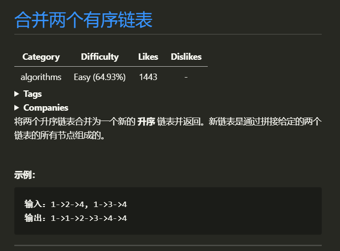

# 合并两个有序链表

## 1.1 题目


## 1.2 思路
> 很简单的合并算法, 数据结构书中的两个链表归并的算法的变式, 可以用不带头节点的思路来进行归并,也可以用带 头节点 方法来归并. 带头节点的算法比较简单,易写.就是简单的将 l1 和 l2 的 `val` 相比较 哪个大哪个丢失一个节点并向后移动,直到其中一个移动到 `NULL`, 返回头节点即可  
> 这道题也可以 用递归思路来求解 如果 l1 或者 l2 一开始就是空链表 ，那么没有任何操作需要合并，所以我们只需要返回非空链表。否则，我们要判断 l1 和 l2 哪一个链表的头节点的值更小，然后递归地决定下一个添加到结果里的节点。如果两个链表有一个为空，递归结束。


## 1.3 图解思路


## 1.4 代码
> #### 迭代
>```c
>struct ListNode *mergeTwoLists(struct ListNode *l1, struct ListNode *l2)
>{
>    struct ListNode *head = (struct ListNode *)calloc(1, sizeof(struct ListNode));
>    struct ListNode *rmq_prve = head;
>
>    while (l1 && l2)
>    {
>        if (l1->val < l2->val)
>        {
>            rmq_prve->next = l1;
>            l1 = l1->next;
>        }
>        else
>        {
>            rmq_prve->next = l2;
>            l2 = l2->next;
>        }
>        rmq_prve = rmq_prve->next;
>    }
>    rmq_prve->next = (NULL == l1 ? l2 : l1);
>    return head->next;
>}
>```
> #### 递归
>```c
> struct ListNode *mergeTwoLists(struct ListNode *l1, struct ListNode *l2)
> {
>     if (NULL == l1)
>         return l2;
>     if (NULL == l2)
>         return l1;
>     if (l1->val > l2->val)
>     {
>         l2->next = mergeTwoLists(l1, l2->next);
>         return l2;
>     }
>     l1->next = mergeTwoLists(l1->next, l2);
>     return l1;
> }
> ```