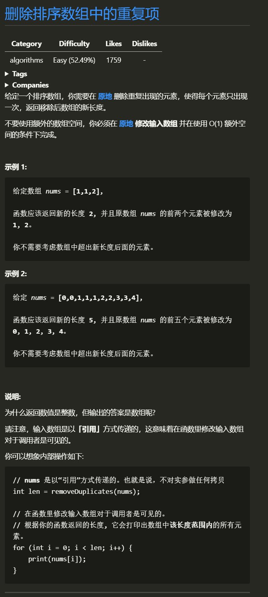

# 删除排序数组中的重复项

## 1.1 题目


## 1.2 思路
> 数组完成排序后，我们可以放置两个指针 `i` 和 `j`，其中 `i` 是慢指针，而 `j` 是快指针。只要 `nums[i] = nums[j]`，我们就增加 `j` 以跳过重复项。当我们遇到 `nums[j] != nums[i]` 时，跳过重复项的运行已经结束，因此我们必须把它(`nums[j]`)的值复制到 `nums[i + 1]`。然后递增 `i`，接着我们将再次重复相同的过程，直到 `j` 到达数组的末尾为止。  
> 简单来说就是 两个指针 一个负责遍历数组的所有元素, 一个负责存储 不相同的元素

## 1.3 图解思路
>```
>```

## 1.4 代码
>```c
>int removeDuplicates(int *nums, int numsSize)
>{
>    if (0 == numsSize)
>        return 0;
>    int index = 0;
>    for (int i = 1; i < numsSize; i++)
>    {
>        if (nums[i - 1] != nums[i])
>        {
>            nums[++index] = nums[i];
>        }
>    }
>    return index + 1;
>}
>```

