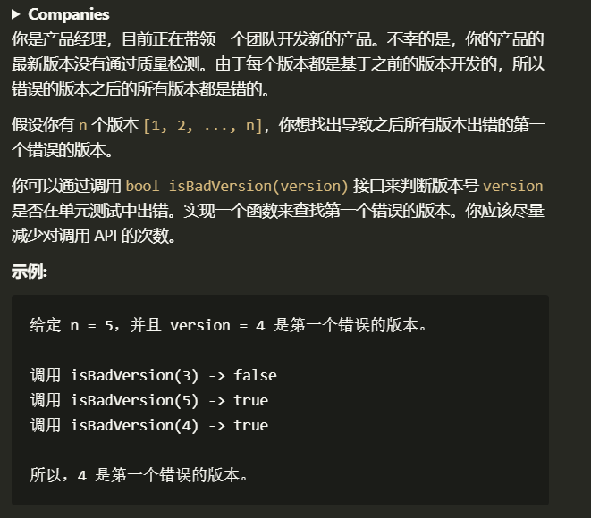

# 数字的补数

## 1.1 题目
---


## 1.2 解题思路
---
> 这道题很简单,只需要注意 `isBadVersion()` 函数返回 true 使代表版本有问题就行了.
>题目的大致意思是, 开发的时候有一个版本出问题了,结果没发现一直错下去了 例如 v5.0 的时候出错了没有发现,一直到了罪后的 vx
.0 版本, 结果发现不合格, 要我们找出 第一次出错的版本, 即 v5.0. 题目还强调了尽量减少调用 API 的次数. 很显然的,暴力肯定过不了, 对于有序的数列进行查找,最合适的方法就是 二分 从 O(n) 到 O(log(n)).  
最大数据到了 2147483647, 怕不是上古级的 APP

## 1.3 代码
---
> ```c
> int firstBadVersion(int n)
> {
>     int hig = n;
>     int low = 1;
> 
>     while (hig < low)
>     {
>         int mid = low + (hig - low) / 2;
>         if (isBadVersion(mid))
>         {
>             hig = mid;
>         }
>         else
>         {
>             hig = mid - 1;
>         }
>     }
>     return hig;
> }
>```