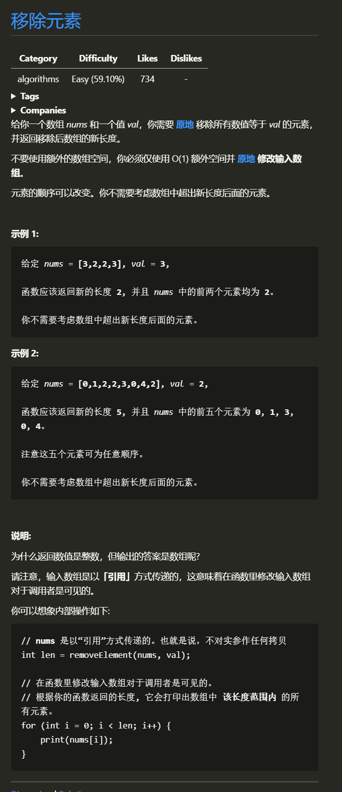

# 移除元素

## 1.1 题目


## 1.2 解题思路：
> 题目要求移除指定元素,其实就是简单的填坑法, 运用快慢指针 `i j`,快指针遍历整个数组,慢指针指向第 n 个不等于 Val 的位置.简单来说就是两个指针同时从一向出发,当遇到与 `val` 相等的值的时候 慢指针 `j` 就放弃自加,这样 `val` 所造成的空间差就能 实现自调节,j 所累加的值即为 与 `val` 不同的值的数组的长度

## 1.3 图解思路
>

## 1.4 代码
>```c
> int removeElement(int *nums, int numsSize, int val)
> {
>     int cnt = 0;
> 
>     for (int i = 0; i < numsSize; i++)
>     {
>         if (nums[i] != val)
>         {
>             nums[cnt++] = nums[i];
>         }
>     }
> 
>     return cnt;
> }
>```
> **调试 主函数 文件在 main.c 中**