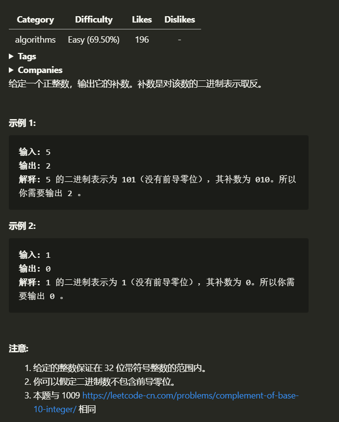

# 数字的补数

## 1.1 题目
---


## 1.2 解题思路
---
> 1. 虽然说是第一次做这种类型的题目, 思路很明确, 逐位后移,判断每一位是否为 1 ,为 1 则 `res |= 0`,否则 在 `res`第 `count` 位 上置  1 .直到 `0 == num` 结束,这种方法可以视为 位运算法.  
> 2. 不使用位运算的方法也有,思路相同 用 `pow` 函数代替 位运算, 在 `num % 2 == 0` 的 时候,进行 + 运算
> 3. 但是,这两个方法还是有些保守,所以我琢磨了一下定义,推导了一下
>```
>    原数         取反码(题目期望)      取补码
>    1010(10)     0 101(5)              1 011(-3)
>    1001(09)     0 110(6)              1 010(-2)
>    1011(11)     0 100(4)              1 101(-5)
>    1100(12)     0 011(5)              1 100(-4)
> ```
> 得出结论 为 取反去掉最高位 但是 用 `1 << (log2(num)+1)`来实现 计算最高位就会出现 `runtime error`, 但是本地运行正常, 有点懵,可能是评测机限制了数据位数? 

## 1.3 图解思路
---
> 

## 1.4 代码
---
> 位运算
> ```c
> int findComplement(int num)
> {
>     int res = 0, index = 0;
> 
>     while (num)
>     {
>         if (!(num % 2))
>         {
>             res += pow(2, index);
>         }
>         index++;
>         num >>= 1;
>     }
>     return res;
> }
> ```
> pow
> ```c
> int findComplement(int num)
> {
>     int res = 0, count = 0;
> 
>     while (num)
>     {
>         res |= (num & 1 ? 0 : 1 << count);
>         ++count;
>         num >>= 1;
>     }
> 
>     return res;
> }
> ```
> 定义
> ```c
>int findComplement(int num)
>{
>    long temp = 1;
>    while (num >= temp)
>    {
>        temp <<= 1;
>    }
>    return (temp - 1 - num);
>}
> ```