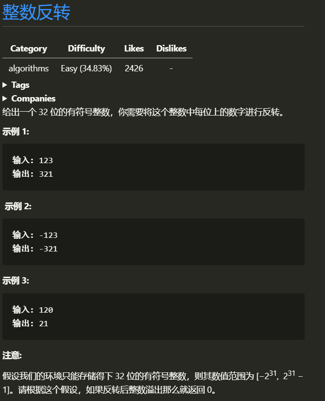
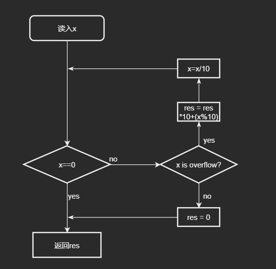

# 整数反转
##### Note: 对于负数运算
>除了-m导致溢出的特殊情况外,其他时候:  
> -    `(-m)/n` 和 `m/(-n)` == `-(m/n)`，
> -    `m%(-n)` ==  `m%n`，
> -    `(-m)%n` == `-(m%n)`
### 1.1 题目


### 1.2 解题思路
>+   读完题目,第一反应是用 sprintf 整型转成字符串,一看见给定的函数原型的返回值  就弃了,既然不能转成字符串,那就干脆学习回文数的方法,逆向构造.每次循环取余得到数的最后一位, 累加器在累加之前 先乘10,直到 0 == x,这道题第一步就完成了
            
>+   接着是边界判定, 可以直接用 long 或者 long long,这样子就会很没意思,而且在32位机上, int、long、long long 在 都为 32 位, 仍然会溢出.我们需要思考出一个通用的解法.
>+   C语言的最值,存放在 limits 这个头文件中, INT_MAX(2,147,483,647) 和 INT_MIN(-2,147,483,648) 分别表示 INT 的两个边界.
>>+    在数学表达式中，写成(res > INT_MAX || res < INT_MIN),肯定是时没问题的,但是
>>+    对于计算机来时, 大于就是溢出 int 型变量的取值属于[INT_MIN, INT_MAX],无论如何溢出(上溢overflow，下溢underflow},其取值永远落在区间[INT_MIN, INT_MAX],表达式(y > INT_MAX || y < INT_MIN)永远为false.需要提前一步判断，否则等到溢出发生时，是没有
    办法通过(y > INT_MAX || y < INT_MIN)来判断是否溢出的.
>+  边界其实我们只需要判断 INT_MAX/10 的值是否大于 res 和 INT_MIN/10的值是否小于 res,因为当 res 的值大于这个条件, 再进入循环则必然溢出
>> 例如:
    1163847418,逆序之后是8147483611, 当 res = 814748361 如果再进循环必然上溢,所以通过在 执行 累加前进行溢出判断来检测溢出

#### 关于反向构造 :  
> ```res = res * 10 + x % 10```这个等式是怎么来的呢?  
> 思考一下啊 我们如何取出 每一位上的数 最简单的的方法就是对10取余  
> 取余每次取出的数都是低位 例如 451 取余 10 得到的先是1, 然后才是5,最后才是4, 那么451怎么变成154呢?  
> 显然 1* 100 + 5 * 10 + 4 将这个式子变形一下:  
> ```  
>                (1 * 10 + 5) * 10 + 4  
> ```
> rm1 = 1, rm2 = 5, rm3 = 4 分别是 三次 取余的出来的数 
> 式子变为
> ```
>               (rm1 * 10 + rm2) * 10 + rm3 
> ```
> 抽象一下, 分成 3步
> ``` 
>  设 res 为 最终结果, rm1, rm2, rm3为三次的余数
> 则有:
>   第一次:
>       res = res + rm1;
>   第二次:
>       res = res * 10 + rm2;
>   第三次
>       res = res * 10 + rm3;
> ```
> 很容易的发现除了第一次之外 递推通式为 ```res = res * 10 + rmx``` 所以我们,一开始令 res 为 0 ,0 * 10 = 0,不影整个式子计算
> 所以 得到了代码中的 ``` res = res * 10 + (x%10);```
>> 举个例子: a = 123
>> ```
>> 第一次:
>>   初值 res = 0, x = 123
>>       res = 0 * 10 + (123%10) = 3
>>       x = 123 / 10 = 12
>> 第二次
>>   初值 res = 3, x = 12
>>       res = 3 * 10 + (12%10) = 32
>>       x = 12 / 10 = 1
>> 第三次
>>   初值 res = 32, x = 1
>>       res = 32 * 10 + (1%10) = 321
>>       x = 1 / 10 = 0
>> 最终结果:
>>      res = 321       x = 0
>> ```
> 
    

### 1.3 流程图

<!-- ```flow
st=>start: 开始
cond1=>condition: res > MAX
cond2=>condition: x == 0
op1=>operation: res = 0
op3=>operation: res = res / 10
op2=>operation: res = res * 10 + res % 10
e=>end: 返回res

st->cond2
cond2(yes)->e
cond2(no)->cond1
cond1(no)->op2(right)->op3(right)->cond2
cond1(yes)->op1(left)->e
``` -->
### 1.4 代码
> ```c
> int reverse(int x)
> {
>     if (x < 10 && x > -10)
>     {
>         return x;
>     }
>     /**
>      * 反向构造 每次取余 出来的数 加上 res*10 ,计算前先判断
>      */
>     int res = 0;
>     while (x)
>     {
>         if (res > INT_MAX / 10 || res < INT_MIN / 10)
>         { // 边界判断 当 res
>             return 0;
>         }
>         res = res * 10 + x % 10;
>         x /= 10;
>     }
>     return res;
> }
> ```
