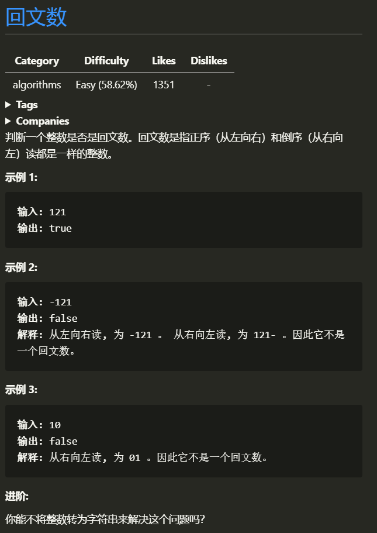
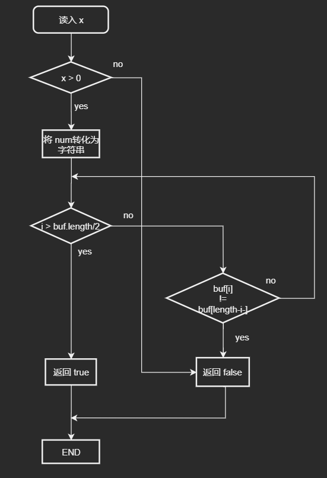
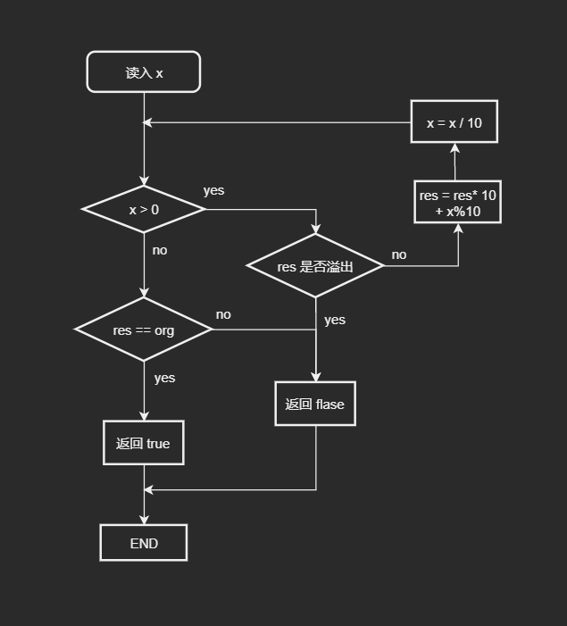

# 回文数
### 1.1 题目


### 1.2 解题思路

> 这道题有两种解法: 字符串 和 反向构造, 先来说说简单的字符串处理方法
>> 字符串:  
这种方法很简单, 利用 `sprintf` 来将 x 写入到 buf 中 对折检测 就可即可,由于 `sprintf` 的时间复杂度未知,不清楚总体时间复杂度  
>> 反向构造:  
回文数的最大特点是, 反转后等于其本身, 很显然 在 int 范围内 只要符合回文数性质的数 肯定会有两个约束: 1.不是负数 2.逆序后不不会溢出.这里得出了两个 if 语句.接下来通过回文数的通性来得出判断方法  
现有两个数 `num1 = 123456`, `num2 = 123321`
`num1` 不是回文数, `num2` 是回文数.人是如何判断是不是回文数的呢? 大部分人都是 将这个数字一分为二来判断的,这种方法就是第一种方法字符串法.计算机肯定肯定没有这么智能,对他来说 最简单的方法就是 把整个数反转过来,不依赖字符串,需要取出各个位上的数,那种只能循环对10取余,那就又是 P7 的那两句核心算法,这里也需要判断溢出,然后在循环结束时判定一下,反转值是否等价于初始值即可

### 1.3 流程图

> #### 解法1

>> 

> #### 解法2

>> 

### 1.4代码

> #### 解法1
>
> ```c
> bool isPalindrome(int x)
> {
>     if (x < 0)
>     {
>         return false;
>     }
>     if (x < 10)
>     {
>         return true;
>     }
>
>     char buf[33] = "";
>     // 时间复杂度未知
>     sprintf(buf, "%d", x);      // 将 数字转换为字符 双向查找
>     int length = strlen(buf);
>
>     for (int i = 0; i < length / 2; i++)
>     { // 时间复杂度 对折O(n/2)
>         if (buf[i] != buf[length - 1 - i])
>         {
>             return false;
>         }
>     }
>     return true;
> }
>```

> #### 解法2
> ```c
> bool isPalindrome(int x)
> {
>     if (x < 0)
>     {
>         return false;
>     }
>     if (x < 10)
>     {
>         return true;
>     }
> 
>     int org_num = x;
>     int res_num = 0;
>     while (org_num)
>     {
>         if (res_num > INT_MAX / 10)
>         {
>             return false;
>         }
>         res_num = res_num * 10 + (org_num % 10);
>         org_num /= 10;
>     }
>     if (res_num == x)
>     {
>         return true;
>     }
>     return false;
> }
> ```

